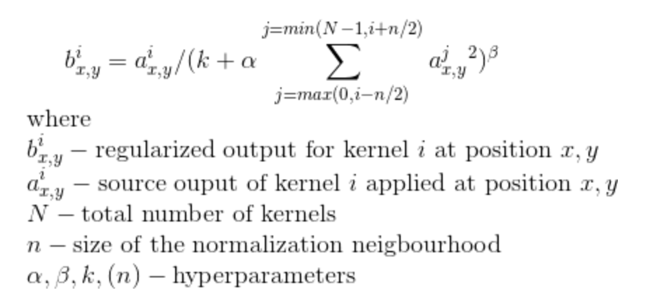

# AlexNet-PyTorch

## Model

    

AlexNet은 2012년 ILSVRC대회에서 1위를 한 모델이다. 기존의 모델과는 달리 GPU 병렬처리를 통해 더욱 빠르게 학습할 수 있다는 특징이 있다.

  

    

또한, 활성화 함수로 ReLU를 사용하기 시작하며 기존의 tanh 활성화 함수보다 약 6배 이상 빠른 학습 속도를 보여준다.

  

    

Local Response Normalization(LRN)은 ReLU 함수의 특성상 값이 무한대로 커지는 것을 방지위해 사용된다. 즉, regularization 용도로 사용된다.

LRN은 현재 포인트에 인접한 부분들에 작용하여 overfittng을 방지와 일반화하는데 도움이 된다고 한다.

Alexnet은 기존 pooling 방식과 달리 조급씩 겹쳐서 하는 방식인 **Overlapping Pooling**을 통해 overfitting 현상을 개선했다.

  